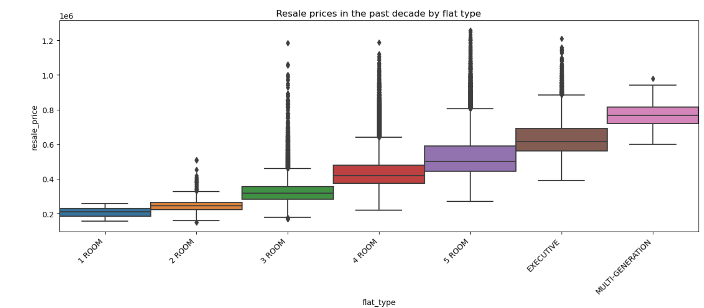

# An analysis on HDB resale prices to understand the features that matter in predicting its future prices

## Project Background 

This is the second graded project, as part of the General Assembly Data Science Immersive (Flex) course. 

## Problem Statement

**Aim: To be find out the desirable traits of a HDB resale flat to be sold at a good price**

There are some common traits that makes a HDB desirable: location, size, and its remaining lease years. While Size and HDB Age is something that has an absolute gauge, location is a trait that is deemed desirable in a relative way. For example, the [recent move of ACS to Tengah](https://www.straitstimes.com/singapore/housing/acs-primary-relocation-likely-to-boost-future-tengah-bto-application-rates-interest-in-bukit-batok-ecs-analysts) has raised hopes of the future profits of selling their HDB flats in the near future. Also, Bishan was not too hot a place in the 90s while it is still being developed, but is now one of the hottest HDB areas, as shown by the data of this project.


The goal of this project is to study the different features that makes a HDB resale flat desirable. The output of this is an article on HDB's portal 'My Nice Home' and guide current and future owners on the opportunities to make the best out of their HDB flats after MOP.

----

## Structure

```
ga_proj2_dsif9
|__ code
|   |__ 01_EDA_and_Cleaning.ipynb   
|   |__ 02_Preprocessing_and_Feature_Engineering.ipynb   
|   |__ 03_Modeling_and_Evaluation.ipynb  
|__ data
|   |__ train.csv
|   |__ test.csv
|   |__ preprocessed_train_data.csv
|   |__ preprocessed_test_data.csv
|   |__ clean_data.csv
|   |__ clean_pred_data.csv
|   |__ submission_hdb.csv
|__ images
|   |__ by_flatmodel.png
|   |__ by_flattype.png
|   |__ by_floor.png
|   |__ by_planningarea.png
|   |__ by_remaining_lease.png
|   |__ by_town.png
|   |__ feature_coeff.png
|   |__ Kaggle_submission_1.png
|__ presentation.pdf
|__ README.md
```
---

## Datasets and Methodology

The dataset given is available on [Kaggle](https://www.kaggle.com/competitions/dsi-sg-project-2-regression-challenge-hdb-price)

|Feature|Type|Description|
|---|---|---|
|flat_type|int|Consist of the types: '4 ROOM', '5 ROOM', 'EXECUTIVE', '3 ROOM', '2 ROOM', '1 ROOM', 'MULTI-GENERATION'|
|floor_area_sqm|int|floor area of the resale flat unit in square metres|
|Tranc_Year|float|the year of transaction, recorded from 2012 - 2021|
|mid|int|middle value of storey_range|
|year_completed|integer|year which construction was completed for resale flat| 
|commercial|int|boolean value if resale flat has commercial units in the same block| 
|precinct_pavillion|int|boolean value if resale flat has a pavilion in the same block| 
|total_dwelling_units|int|total number of residential dwelling units in the resale flat|
|Mall_Nearest_Distance|float|distance (in metres) to the nearest mall|
|Hawker_Nearest_Distance|float|distance (in metres) to the nearest hawker centre|
|mrt_nearest_distance|float|distance (in metres) to the nearest MRT station|
|bus_stop_nearest_distance|float|distance (in metres) to the nearest bus stop|
|pri_sch_nearest_distance|float|distance (in metres) to the nearest primary school|
|cutoff_point|float|PSLE cutoff point of the nearest secondary school|
|region|int|To reduce the amount of one-hot encoding on town, I will group them into 5 regions, taking reference from [the URA list of regions by towns](https://www.newlaunchesreview.com/regions-of-singapore/). Taking Central as the baseline, this measures the effect of a HDB located in East, North, North East, and West are measured against the effect of a HDB located in the Central.|
|flat_model|int|Taking Standard as the baseline, this measures the effect of a type of HDB according to its model. They are further grouped into 13 types: 'Executive Maisonette':'Maisonette', 'Terrace':'Special', 'Adjoined flat':'Special','Type S1S2':'Special', 'DBSS':'Special', 'Model A2':'Model A', 'Premium Apartment':'Apartment', 'Improved':'Standard', 'Simplified':'Model A', '2-room':'Standard'|
|sec_cutoff|float|Interaction term of sec_sch_nearest_distance with cutoff_point of the secondary school. This is introduced to capture the effect of the quality of secondary school and its distance with the HDB flat|

---

## Techniques and methodology
The project follows the techniques required in a data science project
1. Data Cleaning and Imputation
2. Exploratory Data Analysis
3. Preprocessing and Feature Engineering
4. Modelling
5. Model Tuning 
6. Evaluation

## Data Cleaning
1. There are significant null values for some variables in the original dataset. 
2. if there is no effect from the null values on the y-variables, I will proceed to drop them
3. if there is an effect from the null values on the y-variables, I will first study it's distribution, before deciding on imputing the values with median, mode, or mean
    - one of the variables is skewed to the right, so I imputed the values with median.[source](https://medium.com/analytics-vidhya/appropriate-ways-to-treat-missing-values-f82f00edd9be)

## EDA
1. Then, I study the relationship between the well-known factors for a high HDB resale price. These factors include region, floor area, remaining lease years, and the HDB's distance to amenities.
2. Besides, there are other features available in the dataset. There are a total of 77 features.
3. To be able to capture all the variables, I will find out the effects of the variable's mean/medianx with resale price. This is to prevent bias against the preconception on the well-known factors such as region, floor area, distance to MRT.
4. Then, I will find out the boxplot distributions of these variables. This is to find out the distribution of outliers
5. There are three areas of numbers that I look at:
    - Numeric : Whether they are discrete or continuous
    - Temporal : their effect on y-variable
    - categorical: to further group them into suitable variables

### Findings 
1. Without controlling the flat type, HDB resale flats of town and planning areas are roughly the same. I will drop planning area (the higher amount of variables), and keep town for further grouping
2. Most of the outliers are for bigger flat types - notably 3-room, 4-room and 5-room, which has a long tail.
3. When I examine the median resale prices by the middle storey of storey range, there is a linear relationship (except for floor 15). 
4. Majority of HDB are within 50-200 sqm in terms of size. The range of HDB resale prices is the highest among 100-150 sqm in size.
5. The distribution of resale price varies according to the remaining lease years. Newer flats have a wider range of resale prices, and closer to the higher side of resale prices.




## Preprocessing and Feature Engineering
In this section, I performed the following
1. Simple encode important categorical features
2. Further re-categorize features that can do one-hot encoding
    - Group flat_model, flat_model, full_flat_type into flat_type
    - Group towns into regions, and remove postal, and planning_area, mrt_name as redundant features
3. Perform one-hot encoding on selected categorical features, after grouping them into suitable features
4. Introduce interaction terms for sec_sch_nearest_distance and cutoff point
5. Log predicted variable (resale_price), to make it into a normal distribution

## Modeling
In this section, I will be running a few models. The goal is to explore their potential as the best model to run, so I can re-identify the right features and retrain this best model
1. I will be running Linear Regression, Ridge Regression, Lasso Regression and ElasticNet Regression
2. For each of the models, I will try a base version first
    - vanilla Linear Regression vs Linear Regression with standard scaling
    - normal Ridge Regression vs Ridge Regression with tuned hyperparameters
    - normal Lasso Regression vs Lasso Regression with tuned hyperparameters
    - normal ElasticNet vs ElasticNet with tuned hyperparameters
3. For each of the models, I will be doing the evaluation on the r2 scores of the train and validation sets in train-test-split. I will choose the model balancing on these 3 criteria:
    - High r2 score on validation set
    - low RMSE score
    - Low difference of r2 scores between train and validation set, which means it is not a biased model

## Model tuning 
Ridge regression is the one that fits the criteria most. There are a few features that will be removed due to multicollinearity effects and their effect based on the absolute figure of the coefficients.

After removing the features, I will fit it into the ridge regression model.
- The second optimized ridge model improved r2 score on the validate data slightly by 0.0000001 as compared to the first optimized ridge model
    - This means there's a higher amount of train data being able to be explained by the model
- Also, the RMSE for the refined Ridge model is slighly lower than the first optimized ridge model
    - this means the model has a smaller error
- The difference in R2 score is also smaller
    - this might mean that the model is less biased, which is an improvement

Here is the features from the improved model. 


-----

## Conclusion and Recommendation

The current project of predicting resale market for HDBs focus on the features, more than the effect of time. One of the reasons is that, unlike stock market, HDB prices (or property prices in general) is deemed to be pretty stable and increase over a long period of time.

Therefore, the recommendation to buyers is to look for a HDB, with considerations of salient features such as region, size, distance to amenities, and age. However, future HDB buyers should also consider non-tangible qualities such as personal preference and distance to family. 

-----

## Future enhancements
I think the model can be improve from its current state. Here are some ideas:

1. Group by number of rooms 
    - A 4R HDB flat has the most demand. 
    - In fact, most of the outliers lies with the [4R, 5R, and Executive HDB flats](https://www.propertyguru.com.sg/property-guides/million-dollar-4-room-flats-72832)
    - By controlling the number of rooms, we can train better models with specific features for a 4R-HDB flats

2. Group by regions
    - At first glance, AMK seems to be an undervalued town
    - There is a possibility that the area has older flats; hdb_age is one of the more important features in predicting resale_prices
    - We can do an EDA to find out more
    
3. Group by amenities 
    - currently, amenities such as mrt, school, bus stop, mall and hawker center are shown in meters
    - realistically, amenities within a certain circumference (not by absolute distance) would be considered by a potential buyer
    - therefore, it would be great to group them together for a better analysis 
4. I can further prune the model into lesser features, dropping more features that do not matter
   - for example, I can further drop the features, starting from model_Type S1
5. r2 scores of the models are consistently hovering at 0.838. One of the reasons is due to the grouping of town into regions and that might not be an effective predictor. 
   - For example, Geylang is considered 'central', yet the median resale price is one of the bottom 5.

----

## Libraries
* Pandas
* Numpy
* Matplotlib
* Seaborn
* Scikit Learn 
    * preprocessing
    * linear model
    * model selection
    * metrics
    * TransformedTargetRegressor 

----

## References
1. [the URA list of regions by towns](https://www.newlaunchesreview.com/regions-of-singapore/)
2. [Commentary of the move of ACS to Tengah](https://www.straitstimes.com/singapore/housing/acs-primary-relocation-likely-to-boost-future-tengah-bto-application-rates-interest-in-bukit-batok-ecs-analysts)
3. [Singapore Public Housing wikipedia](https://en.wikipedia.org/wiki/Public_housing_in_Singapore)
